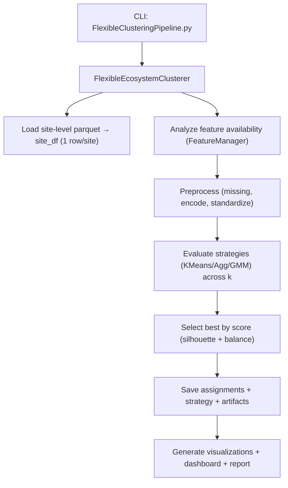

## Flexible Ecosystem Clustering Workflow

Related documents: [Clustering Feature-Sets Deep Dive](./ClusteringFeatureSetsDeepDive.md) · [Clustering Examples and Usage](./ClusteringExamplesUsage.md) · [Train Cluster Models (GPU)](./TrainClusterModelsGPU.md) · [Parquet Spatial Validation Overview](./SpatialValidationOverview.md) · [Parquet Spatial Validation Examples](./SpatialValidationExamples.md)

### Overview

This document outlines the flexible ecosystem clustering workflow centered on `ecosystem/clustering/FlexibleClusteringPipeline.py` and its modular components:

- `FlexibleEcosystemClusterer` (`flexible_clusterer.py`)
- `FeatureManager` and predefined feature sets (`feature_definitions.py`)
- `ClusteringDataPreprocessor` (`data_preprocessor.py`)
- `ClusteringVisualizer` (`clustering_visualizer.py`)

It covers CLI behavior, feature set selection, data loading and preprocessing, strategy evaluation and selection, results saving, visualization, and logging.

### High-level pipeline

### 1. CLI entry and configuration

- **File**: `ecosystem/clustering/FlexibleClusteringPipeline.py`
- **Key args**:
  - `--data-dir`: processed parquet input directory (default `../../processed_parquet`)
  - `--output-dir`: base output (auto-timestamped subfolder)
  - `--feature-set`: one of `geographic, biome, climate, ecological, comprehensive, performance, environmental, plant_functional, v2_core, v2_advanced, v2_hybrid, v3_hybrid, advanced_core, advanced_derived, advanced_hybrid`
  - `--clusters`: trial cluster counts (default `3,4,5,6,7,8,9,10`)
  - `--missing-strategy`: `median|mean|drop|zero` (default: median)
  - `--min-availability`: minimum fraction of required features present (default: 0.5)
  - Info/analysis: `--list-feature-sets`, `--analyze-only`, `--show-feature-details`
  - Visualization: `--visualize`, `--quick-viz`, `--dashboard`, `--no-3d`
  - Verbosity: `--verbose` (default True), `--quiet`
- **Flow**: Validates inputs, creates timestamped output folder, instantiates clusterer, optionally lists/analyzes, runs clustering, saves outputs, generates visualizations.

### 2. Modular clusterer and components

- **File**: `ecosystem/clustering/flexible_clusterer.py`
- **Clusterer initializes**:
  - `FeatureManager` (feature definitions)
  - `ClusteringDataPreprocessor` (availability, missing handling, encoding, scaling)
  - `ClusteringVisualizer` (plots and dashboards)
  - Optional site split metadata (train/test) for downstream modeling
- **Results tracked**: assignments CSV, strategy JSON, processed features, and visualization assets.

### 3. Feature sets

- **File**: `ecosystem/clustering/feature_definitions.py`
- Curated sets for different aims:
  - Geographic/biome/climate/ecological/comprehensive/plant_functional
  - Legacy sets (`v2_*`, `v3_hybrid`, `advanced_*`) for ablations and compatibility
- Each `FeatureSet` defines `numeric_features`, `categorical_features`, and a description.

### 4. Data loading

- **Method**: `FlexibleEcosystemClusterer.load_site_data()`
- Reads each site parquet from `--data-dir`, loads sample rows, extracts site-level variables, composes a single DataFrame (one row per site) with site identifier.

### 5. Preprocessing

- **File**: `ecosystem/clustering/data_preprocessor.py`
- Steps:
  - Validate requested features vs available columns; print availability report
  - Enforce minimum availability (default 50%); suggest alternates if too low
  - Build clustering DataFrame with numeric features (+lat/lon for viz if present)
  - Handle missing values per strategy; encode categoricals with `LabelEncoder`
  - Standardize numeric features via `StandardScaler`
  - Save encoders/scaler summary for reproducibility

### 6. Strategy evaluation

- Algorithms: KMeans (n_init=10), Agglomerative, Gaussian Mixture Models
- For each k in `--clusters`:
  - Fit, compute silhouette score
  - Compute balance ratio = min(cluster size)/max(cluster size)
  - Store strategy records (algorithm, k, scores, labels)

### 7. Strategy selection

- **Scoring** (defaults):
  - `eco_score = silhouette * 1.5`, `balance_score = balance_ratio * 1.0`
  - `final_score = eco_score + balance_score`
- Filters out extremely unbalanced solutions (min balance threshold 0.15). Picks highest final score.

### 8. Results saving

- Assignments: `flexible_site_clusters_{timestamp}.csv` with `site, cluster`
- Strategy: `flexible_clustering_strategy_{timestamp}.json` (algorithm, k, scores, features used, preprocessing summary, counts, metadata)
- Preprocessing artifacts: label encoders, scaler, preprocessing summary JSON

### 9. Visualization

- **File**: `ecosystem/clustering/clustering_visualizer.py`
- `generate_visualization_report()` produces:
  - 2D feature spaces (PCA, t‑SNE when >1 feature)
  - Silhouette analysis
  - Geographic plots (static + interactive) when lat/lon available
  - Strategy comparison (if multiple strategies retained)
  - Feature importance (PCA/variance hybrid)
  - 3D interactive (PCA/t‑SNE) when feasible
  - Interactive dashboard and an index HTML report linking outputs

### 10. Logging

- Verbose by default unless `--quiet`.
- Prints initialization, data loading stats, compatibility details, strategy scores, output paths, and visualization counts.

### 11. Failure modes and recovery

- No parquet files → abort with message
- Insufficient feature availability → recommendations for alternate feature sets
- Per-feature encoding errors continue with warnings
- Missing viz deps → warns with install hint; core pipeline still saves results

### 12. Reproducibility

- Timestamped output folders per run
- Strategy JSON, preprocessing artifacts, and a visualization report capture configuration and results
- Record exact CLI command and feature set used for each run
