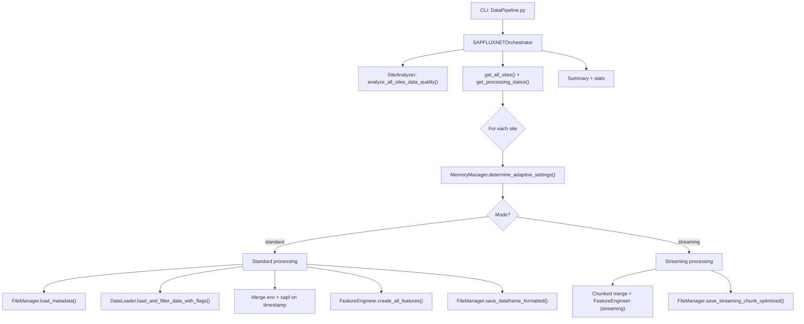

## Comprehensive SAPFLUXNET Data Processing Workflow

Related documents: [Engineered Features Deep Dive](./EngineeredFeaturesDeepDive.md) · [Data Pipeline Examples and Usage](./ExamplesUsage.md)

### Overview

This document describes the end-to-end workflow of the SAPFLUXNET data processing pipeline, centered on the CLI entry-point `DataPipeline.py` and the modular components under `data_processing/`. It details data discovery, validation, adaptive memory strategy, feature engineering, categorical encoding policy, I/O/export, and logging conventions.

### High-level pipeline

## 1. CLI entry point and configuration

- **File**: `DataPipeline.py`
- **Purpose**: User-facing CLI wrapper that configures and delegates to the orchestrator.
- **Key options**:
  - **--feature-set**: `default | temporal | ecological | interaction | comprehensive` (default: `comprehensive`)
  - **--force**: reprocess all valid sites
  - **--include-problematic / --clean-mode**: control inclusion policy for sites with high flag rates
  - **--no-quality-flags**: disable filtering rows with flags
  - **--export-format**: `csv | parquet | feather | hdf5 | pickle | libsvm`
  - Overrides: `--memory-threshold`, `--file-size-threshold`, `--chunk-size-override`, `--max-lag-hours`, `--rolling-windows`
- **Flow**:
  - Prints selected feature-set meta from `ProcessingConfig`.
  - Builds `SAPFLUXNETOrchestrator` with the provided flags and overrides.
  - Either runs analysis-only or the full processing workflow.

## 2. Orchestrator: central coordinator

- **File**: `data_processing/Orchestrator.py`
- **Classes**:
  - `ProcessingConfig`: central configuration repository for thresholds, feature toggles, chunk sizes, and feature-set presets.
  - `SAPFLUXNETOrchestrator`: coordinates initialization, site analysis, per-site processing, and export.
- **Initialization**:
  - Applies feature-set via `ProcessingConfig.apply_feature_set()`.
  - Creates dynamic output dir suffixing format and feature-set (e.g., `csv_comprehensive`).
  - Instantiates `FileManager`, `MemoryManager`, `DataLoader`, `SiteAnalyzer`.
- **Overrides**: CLI overrides are applied to `ProcessingConfig` in `apply_config_overrides`.

## 3. Site discovery and quality analysis

- **File**: `data_processing/SiteAnalyzer.py`
- **Discovery**: `get_all_sites()` parses `sapwood/*.csv` filenames to infer site IDs robustly.
- **Quality analysis**: `analyze_all_sites_data_quality()` classifies sites into:
  - `no_valid_data`, `insufficient_temporal` (<30 days), `moderate_temporal` (30–90 days), `adequate_temporal` (≥90 days)
- **Artifacts** (`site_analysis_results/`): JSON, CSV summary, and TXT report per run.
- **Skip policy**: `should_skip_site()` uses classification, problematic lists, and existing processed file checks.

## 4. Adaptive per-site processing mode

- **Decision point**: `orchestrate_site_processing()`
- Uses dataset sizes + system memory and `MemoryManager.determine_adaptive_settings()` to choose:
  - `use_streaming` (True/False) and `chunk_size`.
- **Modes**: Standard (`_orchestrate_standard_processing`) vs Streaming (`_orchestrate_streaming_processing`).

## 5. Standard processing workflow

1) Load metadata: `FileManager.load_metadata(site)`
2) Validate sap flow: `SiteAnalyzer.validate_sap_flow_data()`
3) Load env/sapf with flags: `DataLoader.load_and_filter_data_with_flags()`
4) Detect and convert timestamps, set indices
5) Melt sapf to long `[timestamp, plant_id, sap_flow]`, inner-join with env on timestamp
6) Drop rows with missing `sap_flow`
7) Feature engineering: `FeatureEngineer.create_all_features()`
8) Save via `FileManager.save_dataframe_formatted()`

## 6. Streaming processing workflow

- Builds time index for sap-flow in chunks; iterates env chunks and constructs aligned records lazily.
- Invokes `FeatureEngineer.create_all_features(..., processing_mode='streaming')`.
- Saves chunk-by-chunk via `FileManager.save_streaming_chunk_optimized()`.
- Note: seasonality features are skipped in streaming mode.

## 7. Feature engineering (summary only)

- Vectorized, memory-aware; chunking/parallel where applicable.
- Temporal features, environmental rolling/lag/roc/cumulative, interactions, domain-specific ecophys proxies, metadata-derived features, seasonality (site-level), conservative categorical encoding, and final schema normalization.

## 8. I/O and export

- **File**: `data_processing/FileManager.py`
- Handles csv/parquet/feather/hdf5/pickle/libsvm (+ optional gzip for csv/libsvm).
- Standardizes per-site features to a reference (`THA_KHU`) for tabular formats.
- For libsvm: creates `feature_mapping.json` with ordered feature names and index map.

## 9. Memory management

- **File**: `data_processing/MemoryManager.py`
- Adaptive thresholds for streaming and chunk sizes; GC-based cleanup when memory is tight.
- Compression-aware chunked CSV loading; caps resident chunks to limit peak memory.

## 10. Logging policy

- **File**: `data_processing/logging_utils.py`
- Minimal by default; always shows key phases and errors.
- Key phases surfaced:
  - Engineering Features
  - Encoding Features
  - Dropping Problematic Columns
  - Ensuring Data Compatibility

## 11. CLI usage patterns and presets

- Full pipeline (csv):
  - `python DataPipeline.py --feature-set comprehensive --export-format csv`
- High-memory parquet export:
  - `python DataPipeline.py --feature-set comprehensive --export-format parquet --compress`
- Temporal-only features:
  - `python DataPipeline.py --feature-set temporal --export-format csv`
- Analysis-only (no processing):
  - `python DataPipeline.py --analyze-only`
- Cleaner site inclusion (keep moderate/high, exclude only extreme):
  - `python DataPipeline.py --clean-mode`
- Force reprocess all valid sites:
  - `python DataPipeline.py --force`
- Common overrides:
  - `--max-lag-hours 24`, `--rolling-windows "3,6,12,24,48,72,168,336,720"`, `--chunk-size-override 1500`, `--memory-threshold 6`, `--file-size-threshold 100`

## 12. Processing-mode decision logic

- Low memory or large files → streaming mode.
- Standard mode when full in-memory merge and seasonality are feasible.
- Streaming: builds sap-flow time index, aligns per env chunk, saves incrementally.

## 13. Site analysis outputs and usage

- `site_analysis_results/` contains JSON, CSV summary, and TXT report per run.
- Categories: `no_valid_data`, `insufficient_temporal`, `moderate_temporal`, `adequate_temporal`.
- Skip policy: always skip `no_valid_data` and `insufficient_temporal`; moderate processed with warnings; problematic lists honored per flags.

## 14. Data loading, quality flags, and merges

- `DataLoader` resolves `.gz`, applies `BAD_QUALITY_FLAGS = ['OUT_WARN','RANGE_WARN']` when enabled, renames `TIMESTAMP_solar` → `solar_TIMESTAMP`, drops `PROBLEMATIC_COLUMNS_TO_EXCLUDE`.
- Merge (standard): detect primary timestamp columns, convert to datetime, melt sapf, inner-join on timestamp, drop missing `sap_flow`.

## 15. Export and format behavior

- CSV (optional gzip); Parquet/Feather/HDF5/Pickle with dependency checks; LibSVM with feature mapping.
- Reference alignment to `THA_KHU` for tabular formats; adds missing 0.0, removes extras, reorders.
- Streaming export: CSV appends (header on first chunk only).

## 16. Reproducibility and configuration trace

- CLI prints feature set, dynamic output dir, and overrides.
- Recommendations: record full CLI command, feature set, overrides; keep site analysis artifacts with outputs; prefer Parquet for durable storage.

## 17. Failure modes and recovery

- Missing env/sapf: site excluded with reason.
- No timestamp or no valid sap-flow columns: site excluded with reason.
- Corrupted/small outputs: validated and reprocessed on next run.
- Export failure: automatic fallback to CSV with warning.

## 18. QA checklist

- Before: ensure `sapwood/` has `*_env_data.csv` and `*_sapf_data.csv` per site; choose feature set and export format; decide clean mode.
- During: watch key phases and per-site progress; confirm streaming on low-memory + large files.
- After: check `site_analysis_results/`, spot-check outputs for `sap_flow`, column count, schema; verify `feature_mapping.json` for libsvm.

## Appendix — Data constants and schema policy highlights

- Identity and proxy protection:
  - `IDENTITY_BLACKLIST` drops site/plant/tree identifiers and administrative meta.
  - `PURE_GEOGRAPHIC_IDENTIFIERS` avoided; climate-geographic features allowed.
- Approved ecological categoricals via `CATEGORICAL_ENCODINGS`.
- Species → functional group mapping (exact + genus-level; unmatched → `unknown`).
- Quality flags: `BAD_QUALITY_FLAGS = ['OUT_WARN', 'RANGE_WARN']`.
- Early drop list includes `pl_name`, `swc_deep`, `netrad`, `seasonal_leaf_area`, remarks codes, short-window precip proxies, etc.; retains `wind_stress`, `ppfd_efficiency`, stomatal indices.
